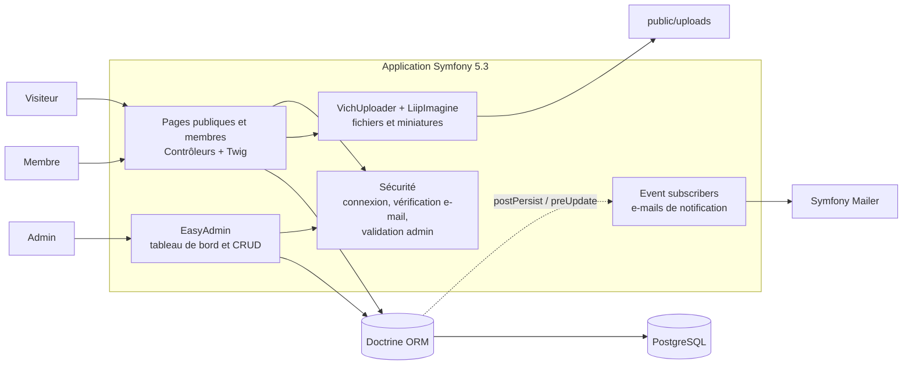
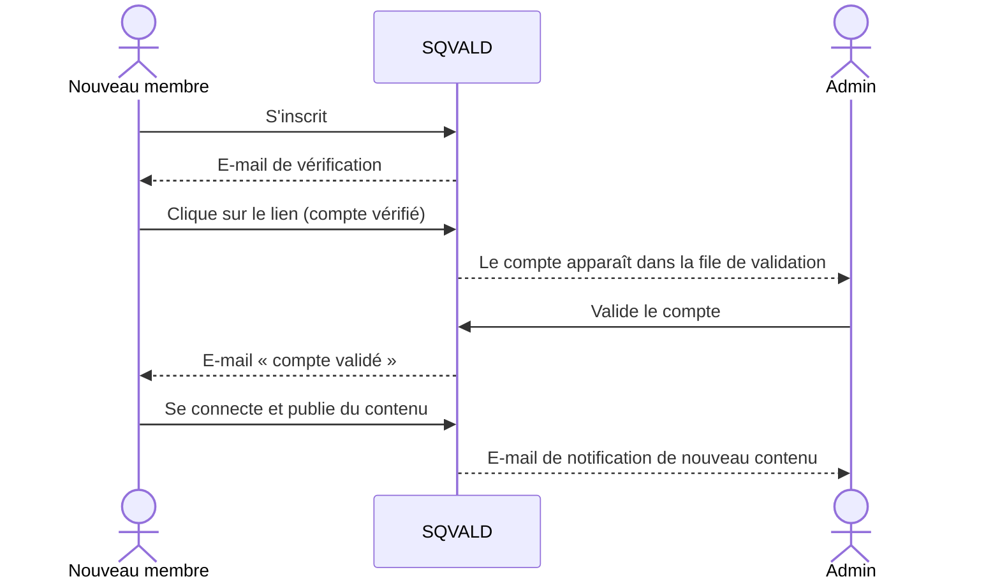
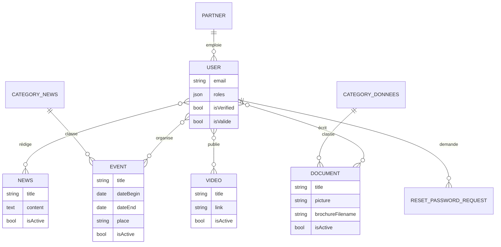

# SQVALD — site web du consortium

**Français** · [English](README.md)

[](https://github.com/lokiap/SQVALD/actions/workflows/tests.yml)


Plateforme web du projet **SQVALD**, un projet de recherche régional (Centre-Val de Loire, dispositif RTR DIAMS) sur les soins de support pour les patients atteints de maladies chroniques ou d'affections de longue durée comme le cancer. Le projet réunit un laboratoire d'informatique, des hôpitaux, des associations de patients et des partenaires locaux. Ce site est leur espace commun : il présente le projet au public et permet aux membres du consortium de publier actualités, évènements, documents et vidéos, chaque compte et chaque contenu étant validé par un administrateur.


## Fonctionnalités

**Site public**
- Page d'accueil avec un bandeau défilant des dernières nouvelles et un carrousel des partenaires.
- Page « À propos » avec les objectifs du projet et les work packages.
- Nouvelles, évènements, documents et vidéos, chacun avec un panneau de recherche/filtres et une pagination.
- Calendrier des évènements, consultable par année.
- Page consortium listant les organisations partenaires et leurs membres.

**Espace membres**
- Inscription avec vérification de l'adresse e-mail, puis validation manuelle par un administrateur avant la première connexion.
- Espace personnel pour modifier son profil et gérer ses propres documents, évènements, nouvelles et vidéos.
- Éditeur de texte riche (CKEditor) et envoi de fichiers (images, PDF, Word) avec génération de miniatures.
- Réinitialisation du mot de passe par e-mail.

**Administration**
- Tableau de bord EasyAdmin avec compteurs et file de validation (comptes, documents, évènements, nouvelles, vidéos en attente).
- CRUD complet sur toutes les entités, partenaires et utilisateurs compris.
- E-mails automatiques : les administrateurs sont prévenus de chaque nouveau contenu, et l'utilisateur de la validation de son compte.

## Captures d'écran

> Prises sur une instance locale chargée avec les fixtures de démonstration (voir plus bas).

| Nouvelles | Calendrier |
|---|---|
|  |  |
| **Documents** | **Partenaires** |
|  |  |
| **Tableau de bord admin** | **Espace membre** |
|  |  |

## Architecture



### Cycle de vie d'un compte

Un nouveau membre ne peut se connecter qu'une fois son e-mail confirmé **et** son compte validé par un administrateur. Les deux vérifications sont faites à la connexion dans `CheckVerifiedUserSubscriber`.



### Modèle de données



Chaque contenu a un indicateur `isActive` : il reste masqué sur le site public tant qu'un administrateur ne l'a pas publié.

## Stack technique

| Couche | Outils |
|---|---|
| Framework | Symfony 5.3, Twig, Symfony Forms et Validator |
| Données | Doctrine ORM et Migrations, PostgreSQL 13 |
| Administration | EasyAdmin 3 |
| Authentification | Symfony Security, SymfonyCasts Verify Email et Reset Password |
| Contenu | CKEditor, VichUploader, LiipImagine, KnpPaginator |
| E-mail | Symfony Mailer |
| Front-end | Bootstrap, Font Awesome |
| Qualité | Tests fonctionnels PHPUnit, GitHub Actions |
| Déploiement | Docker Compose (base de données), `Procfile` Heroku |

## Installation

Prérequis : PHP 8.1 ou 8.2 avec les extensions `intl`, `pdo_pgsql` et `gd`, Composer, et Docker (ou un PostgreSQL 13 local).

```bash
git clone https://github.com/lokiap/SQVALD.git
cd SQVALD
composer install

# PostgreSQL sur le port 5432 + pgAdmin sur http://localhost:5050
docker compose up -d

php bin/console doctrine:migrations:migrate
php bin/console doctrine:fixtures:load     # données de démo
symfony serve                              # ou : php -S 127.0.0.1:8000 -t public
```

Le `.env` versionné ne contient que des valeurs locales par défaut, alignées sur `docker-compose.yml`. Les vrais paramètres (base de données, `APP_SECRET`, `MAILER_DSN`) vont dans un fichier `.env.local`, ignoré par git. Par défaut, les e-mails ne partent pas (`MAILER_DSN=null://null`).

### Comptes de démonstration

Les fixtures créent les partenaires du consortium, des nouvelles, évènements et documents, ainsi que ces comptes (mot de passe `demo1234` pour tous) :

| E-mail | Rôle |
|---|---|
| `admin@demo.local` | Administrateur |
| `b.durand@demo.local` | Membre |
| `c.petit@demo.local` | Membre |
| `d.moreau@demo.local`, `e.leroy@demo.local` | En attente de validation (connexion refusée) |

## Tests

Des tests fonctionnels couvrent les pages publiques, le filtre de publication (`isActive`), le calendrier, le contrôle d'accès et les règles de connexion (un compte en attente de validation est refusé). Ils tournent sur GitHub Actions, avec PostgreSQL, à chaque push.

```bash
php bin/console doctrine:database:create --env=test
php bin/console doctrine:migrations:migrate -n --env=test
php bin/console doctrine:fixtures:load -n --env=test
php bin/phpunit
```

## Structure du projet

```
src/
├── Controller/        # pages publiques, espace membre, Admin/ (CRUD EasyAdmin)
├── DataFixtures/      # données de démonstration
├── Entity/            # User, Partner, News, Event, Document, Video, catégories
├── EventSubscriber/   # vérifications à la connexion et e-mails de notification
├── Form/              # formulaires des entités et filtres de recherche
├── Repository/        # requêtes Doctrine (recherche, calendrier par année)
└── Security/          # authentificateur, vérification d'e-mail
templates/             # vues Twig, un dossier par section
tests/                 # tests fonctionnels (PHPUnit)
migrations/            # migrations Doctrine
public/uploads/        # fichiers envoyés (non versionnés)
```

## Licence

[MIT](LICENSE)
