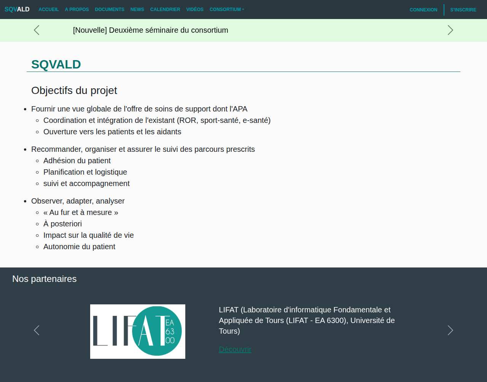
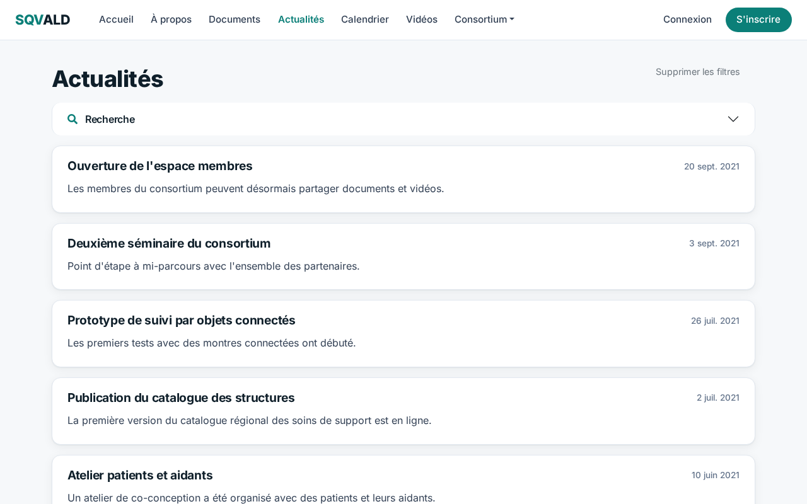
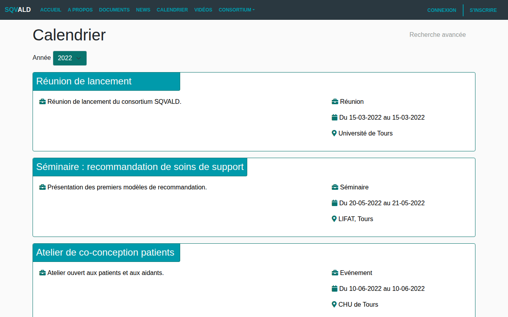
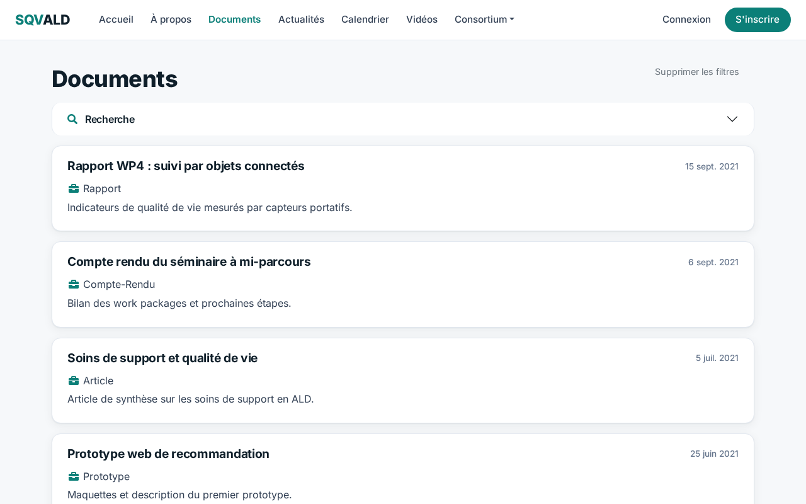
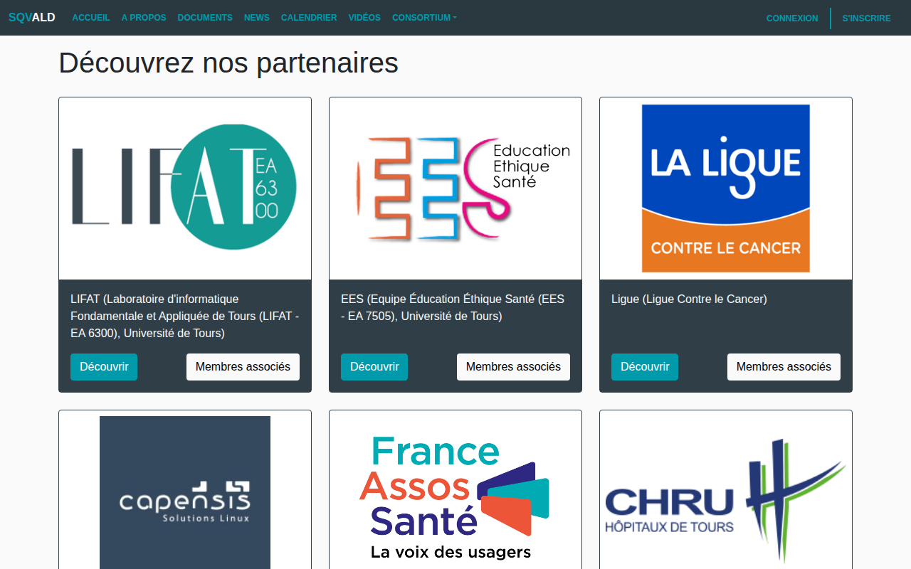
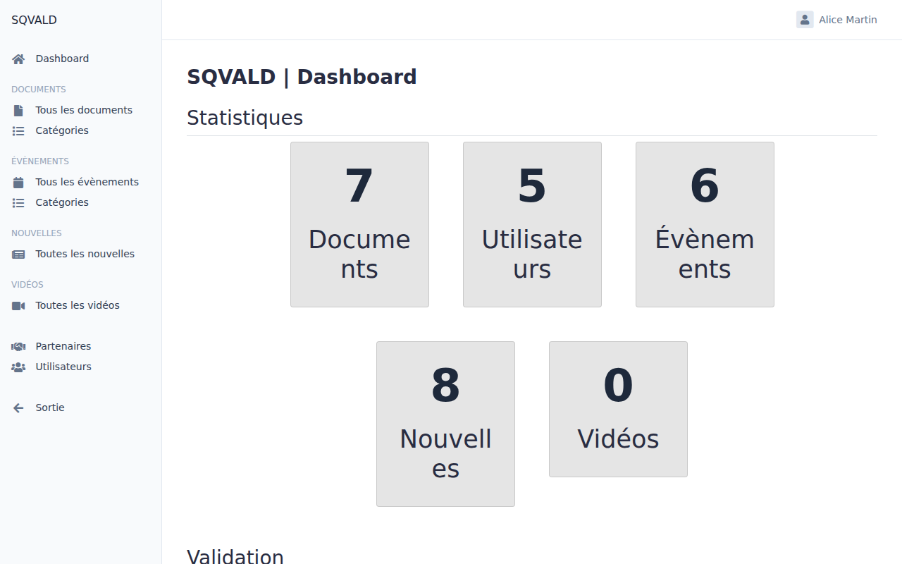
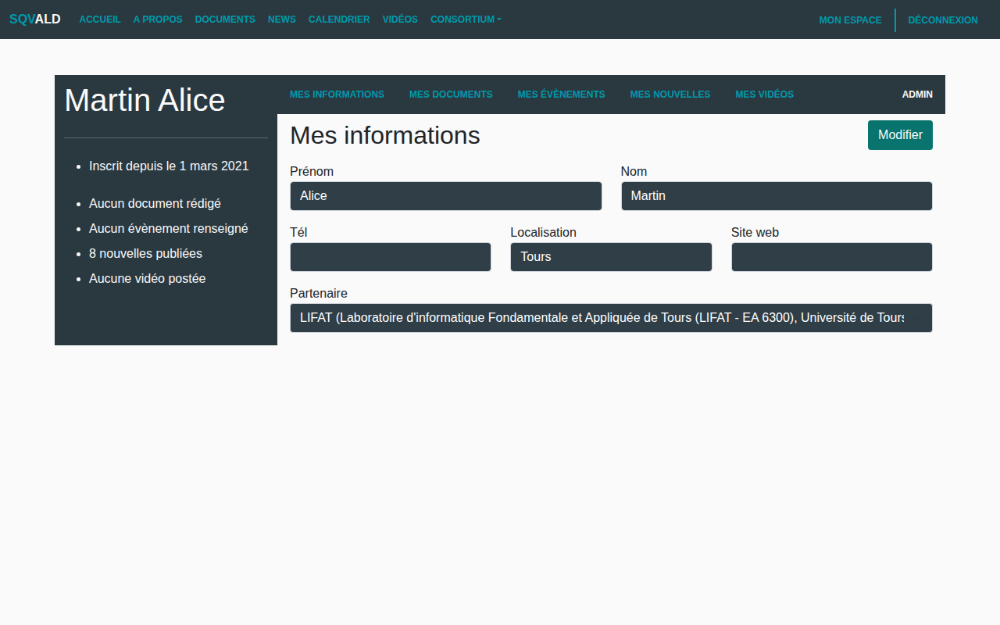
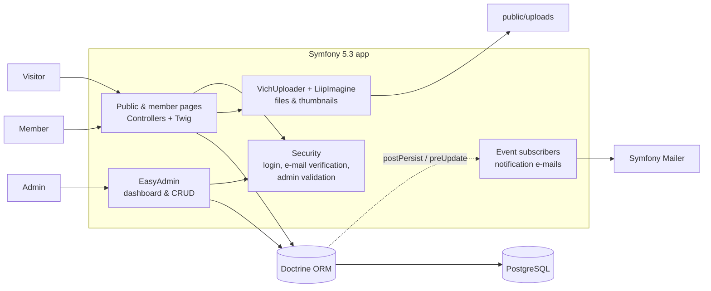
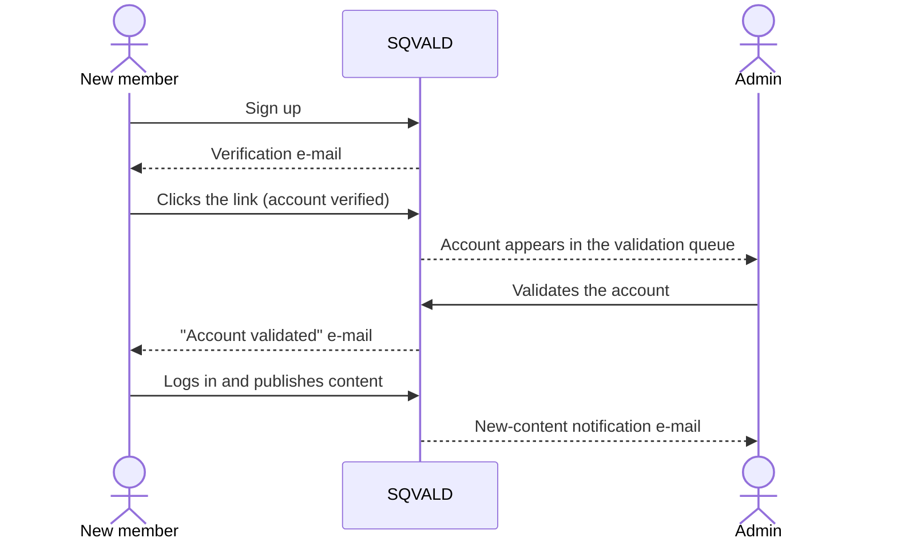
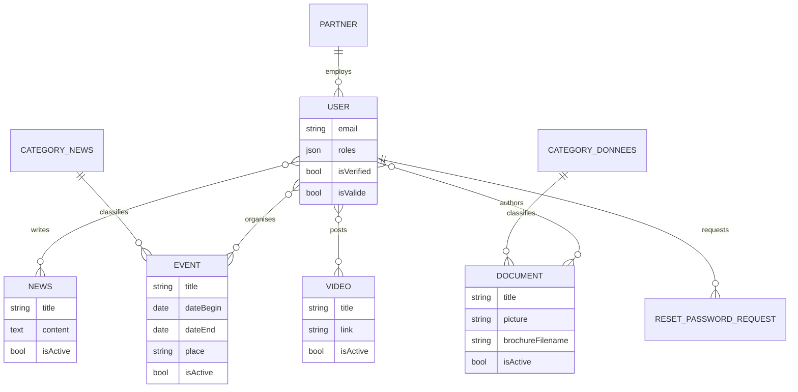

# SQVALD — consortium website

[Français](README.fr.md) · **English**

[](https://github.com/lokiap/SQVALD/actions/workflows/tests.yml)


Web platform for **SQVALD**, a regional research project (Centre-Val de Loire, RTR DIAMS programme) on supportive care for patients with chronic and long-term illnesses such as cancer. The project brings together a computer science lab, hospitals, patient associations and local partners. This website is their shared space: it presents the project to the public and lets consortium members publish news, events, documents and videos, with an admin team validating every account and every piece of content.



## Features

**Public site**
- Home page with a rolling banner of the latest news and a partner carousel.
- "About" page with the project's objectives and work packages.
- News, events, documents and videos, each with a search/filter panel and pagination.
- Calendar of events, browsable by year.
- Consortium page listing the partner organisations and their members.

**Members' area**
- Sign-up with e-mail verification, then manual validation by an admin before the first login.
- Personal space to edit one's profile and manage one's own documents, events, news and videos.
- Rich-text editing (CKEditor) and file uploads (images, PDF, Word) with generated thumbnails.
- Password reset by e-mail.

**Administration**
- EasyAdmin dashboard with counters and a validation queue (pending accounts, documents, events, news, videos).
- Full CRUD on every entity, partners and users included.
- Automatic e-mails: admins are notified when new content is posted, and users when their account is validated.

## Screenshots

> Taken on a local instance loaded with the demo fixtures (see below).

| News | Calendar |
|---|---|
|  |  |
| **Documents** | **Partners** |
|  |  |
| **Admin dashboard** | **Member space** |
|  |  |

## Architecture



### Account lifecycle

A new member can only log in once they have confirmed their e-mail **and** an admin has validated the account. Both checks run in `CheckVerifiedUserSubscriber` at login time.



### Data model



Every piece of content has an `isActive` flag: it stays hidden from the public site until an admin publishes it.

## Tech stack

| Layer | Tools |
|---|---|
| Framework | Symfony 5.3, Twig, Symfony Forms & Validator |
| Data | Doctrine ORM & Migrations, PostgreSQL 13 |
| Admin | EasyAdmin 3 |
| Auth | Symfony Security, SymfonyCasts Verify Email & Reset Password |
| Content | CKEditor, VichUploader, LiipImagine, KnpPaginator |
| E-mail | Symfony Mailer |
| Front-end | Bootstrap, Font Awesome |
| Quality | PHPUnit functional tests, GitHub Actions |
| Deployment | Docker Compose (database), Heroku `Procfile` |

## Getting started

Requirements: PHP 8.1 or 8.2 with the `intl`, `pdo_pgsql` and `gd` extensions, Composer, and Docker (or a local PostgreSQL 13).

```bash
git clone https://github.com/lokiap/SQVALD.git
cd SQVALD
composer install

# PostgreSQL on port 5432 + pgAdmin on http://localhost:5050
docker compose up -d

php bin/console doctrine:migrations:migrate
php bin/console doctrine:fixtures:load     # demo data
symfony serve                              # or: php -S 127.0.0.1:8000 -t public
```

The committed `.env` only holds local defaults that match `docker-compose.yml`. Real settings (database, `APP_SECRET`, `MAILER_DSN`) go in a `.env.local` file, which git ignores. E-mails are discarded by default (`MAILER_DSN=null://null`).

### Demo accounts

The fixtures create the consortium partners, news, events and documents, plus these accounts (password `demo1234` for all of them):

| E-mail | Role |
|---|---|
| `admin@demo.local` | Admin |
| `b.durand@demo.local` | Member |
| `c.petit@demo.local` | Member |
| `d.moreau@demo.local`, `e.leroy@demo.local` | Waiting for admin validation (cannot log in yet) |

## Tests

Functional tests cover the public pages, the publication filter (`isActive`), the calendar, access control and the login rules (an account waiting for validation is refused). They run on GitHub Actions against PostgreSQL on every push.

```bash
php bin/console doctrine:database:create --env=test
php bin/console doctrine:migrations:migrate -n --env=test
php bin/console doctrine:fixtures:load -n --env=test
php bin/phpunit
```

## Project structure

```
src/
├── Controller/        # public pages, member space, Admin/ (EasyAdmin CRUD)
├── DataFixtures/      # demo data
├── Entity/            # User, Partner, News, Event, Document, Video, categories
├── EventSubscriber/   # login checks and notification e-mails
├── Form/              # entity forms and search filters
├── Repository/        # Doctrine queries (search, calendar by year)
└── Security/          # authenticator, e-mail verifier
templates/             # Twig views, one folder per section
tests/                 # functional tests (PHPUnit)
migrations/            # Doctrine migrations
public/uploads/        # uploaded files (not versioned)
```

## License

[MIT](LICENSE)
